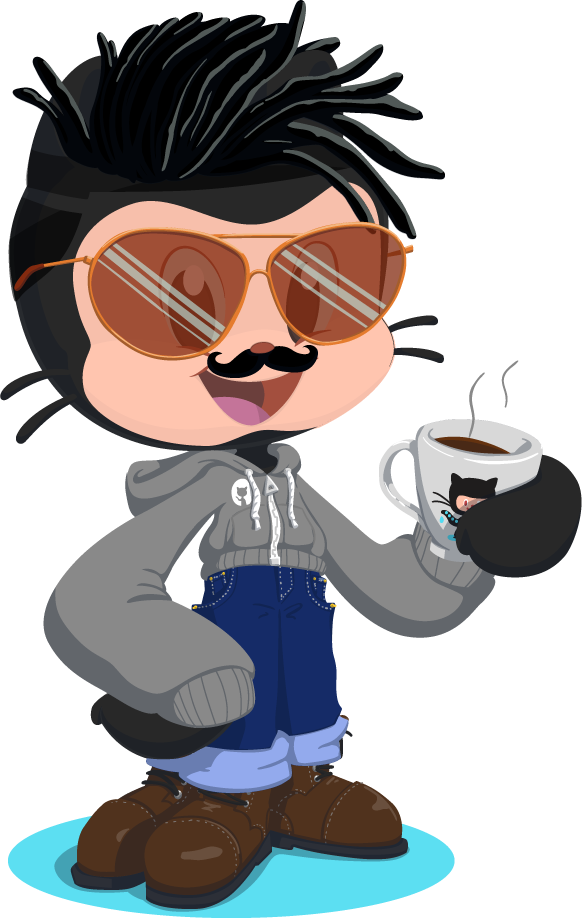

# Hi 👋 I am Karan. मम नाम करणः|

I lead Developer Relations (DevRel) for GitHub in some of our international markets, including India and LATAM. I am on a mission to help every developer be a part of the open source ecosystem and grow their software development skills through the power of GitHub.

## The developer side of me

Python 🐍 is my first love 💙. I also write in Ruby. 

Learning NodeJS and other JS frameworks 📖

SQL and Trino are my superpowers 🦾

Cloud, containers and orchestration is where I go deep 🕵️

You can find me in action with GitHub Actions :octocat:

 

## Oppan GitHub Style

**Author & Maintainer of:**

- [Made in India Collection on GitHub Explore](https://github.com/collections/made-in-india)
- [GitHub Action to Comment on Issue based on Assignees](https://github.com/mvkaran/comment-on-issue)
- [GitHub Action to Check Issue Assignees and Commenters](https://github.com/marketplace/actions/check-issue-assignees-with-commenters)

 

## Connect with me

 

[![Twitter][1.1]][1.2]

[1.1]: https://img.shields.io/badge/Twitter-1DA1F2?style=for-the-badge&logo=twitter&logoColor=white
[1.2]: https://twitter.com/mvkaran

[![LinkedIn][2.1]][2.2]

[2.1]: https://img.shields.io/badge/LinkedIn-0077B5?style=for-the-badge&logo=linkedin&logoColor=white
[2.2]: https://linkedin.com/in/mvkaran

